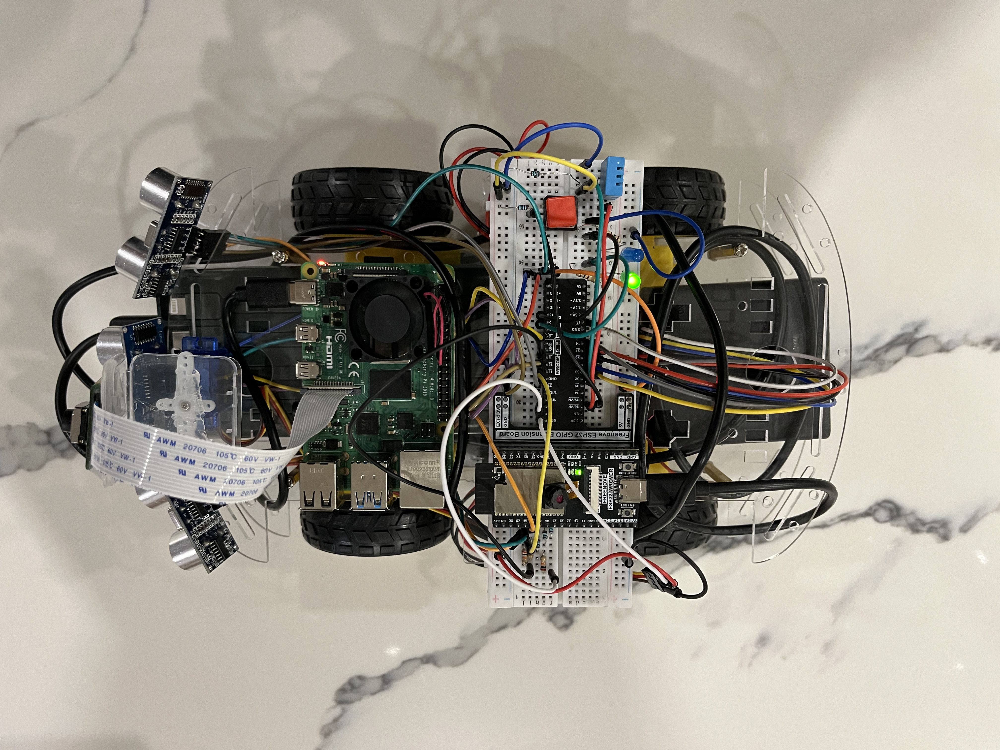
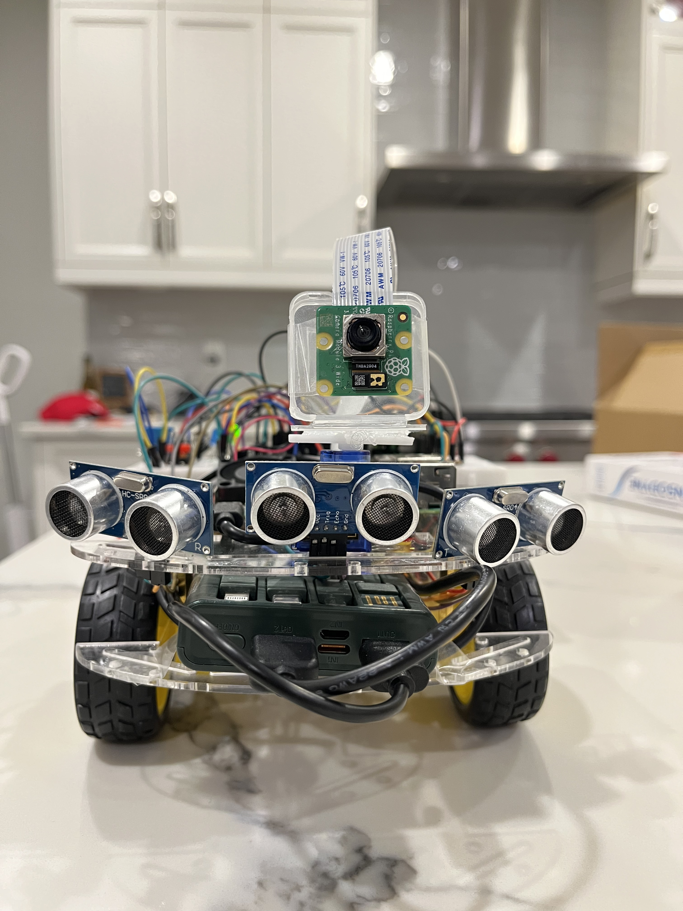
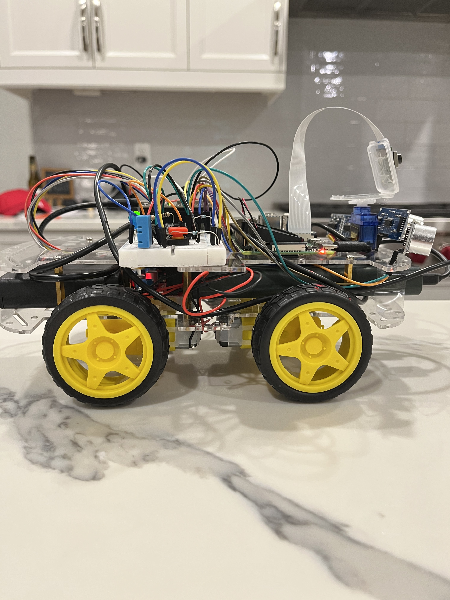
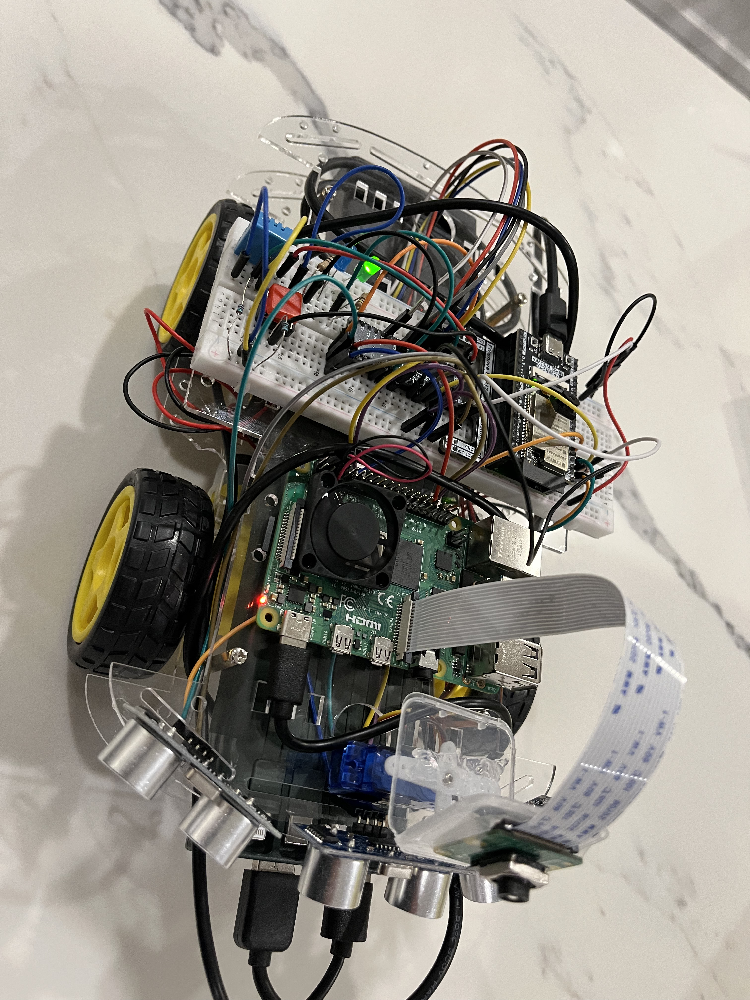

# PiRover

A 4-wheel autonomous/semi-autonomous rover built with a Raspberry Pi 4B and ESP32 WROVER. The rover supports real-time object detection, person following, object search, obstacle avoidance, and a live web dashboard accessible from any device on its WiFi hotspot.

---

## Gallery

### Dashboard


### Rover





---

## Features

- **Live web dashboard** — camera feed, sensor readouts, drive controls, mode switching
- **Manual drive controls** — button clicks or keyboard (arrow keys + space)
- **Camera tilt** — servo-controlled via slider or A/D keys
- **Person following** — detects and follows a person using YOLOv8 nano
- **Object search** — searches for a named object, follows it when found
- **Reactive obstacle avoidance** — front/left/right ultrasonic sensors with automatic steering
- **Kill switch** — hardware button that immediately stops all motors
- **Environmental sensing** — live temperature and humidity via DHT11
- **MQTT-based communication** — ESP32 and Pi communicate wirelessly over a local hotspot

---

## Hardware

| Component | Details |
|---|---|
| Raspberry Pi 4B | Brain — CV, web dashboard, MQTT broker |
| ESP32 WROVER (Freenove board) | Body — motors, sensors, servo |
| L298N Motor Driver | Dual H-bridge, controls 4 DC motors |
| 4x DC Motors | 2WD rear drive, 2 free front wheels |
| Raspberry Pi Camera Module 3 Wide | CSI port, live feed + YOLOv8 detection |
| 3x HC-SR04 Ultrasonic Sensors | Front, left, right obstacle detection |
| DHT11 | Temperature and humidity |
| SG90 Servo | Camera tilt |
| Adafruit Ultimate GPS V3 | Wired to Pi UART (parked, not active) |
| Kill switch button | GPIO 36 with external 9.1kΩ pull-up |
| Green LED | Power indicator (GPIO 2) |
| Blue LED | Mode/kill switch indicator (GPIO 15) |
| 4x AA Battery Pack | Powers L298N and motors |
| USB Power Bank | Powers ESP32 via USB |
| USB-C Power Supply | Powers Raspberry Pi 4B |

---

## ESP32 Pin Map

| Component | Pin |
|---|---|
| L298N ENA | GPIO 14 |
| L298N IN1 | GPIO 27 |
| L298N IN2 | GPIO 26 |
| L298N ENB | GPIO 13 |
| L298N IN3 | GPIO 25 |
| L298N IN4 | GPIO 33 |
| Ultrasonic Front TRIG | GPIO 4 |
| Ultrasonic Front ECHO | GPIO 5 |
| Ultrasonic Left TRIG | GPIO 18 |
| Ultrasonic Left ECHO | GPIO 19 |
| Ultrasonic Right TRIG | GPIO 21 |
| Ultrasonic Right ECHO | GPIO 22 |
| Servo (camera tilt) | GPIO 23 |
| DHT11 | GPIO 32 |
| LED Green | GPIO 2 |
| LED Blue | GPIO 15 |
| Kill Switch | GPIO 36 (external 9.1kΩ pull-up to 3.3V) |

> Each ultrasonic ECHO line uses a voltage divider (10kΩ + 20kΩ) to step 5V down to 3.3V.

---

## Software Architecture

```
┌─────────────────────────────────────┐
│          Raspberry Pi 4B            │
│                                     │
│  dashboard.py  ←→  Mosquitto MQTT   │
│  (Flask + SocketIO + YOLOv8)        │
│                                     │
│  rover_brain.py (obstacle avoidance)│
│  follow_person.py                   │
│  follow_object.py                   │
└──────────────┬──────────────────────┘
               │ WiFi (MQTT)
               │ PiRover Hotspot
               │
┌──────────────┴──────────────────────┐
│            ESP32 WROVER             │
│                                     │
│  Motors, Ultrasonic, Servo, DHT11   │
│  Kill Switch, LEDs                  │
└─────────────────────────────────────┘
```

---

## Setup

### Raspberry Pi

1. Flash Raspberry Pi OS 64-bit (headless)
2. Enable SSH and UART via `raspi-config`
3. Set up WiFi hotspot:

```bash
sudo nmcli device wifi hotspot ifname wlan0 ssid PiRover password rovernet123 band bg
sudo nmcli connection modify Hotspot connection.autoconnect yes
sudo nmcli connection modify "netplan-wlan0-YourHomeSSID" connection.autoconnect no
```

4. Install Mosquitto:

```bash
sudo apt update && sudo apt install -y mosquitto mosquitto-clients
sudo nano /etc/mosquitto/conf.d/rover.conf
# Add: listener 1883
# Add: allow_anonymous true
sudo systemctl enable mosquitto && sudo systemctl start mosquitto
```

5. Set up Python environment:

```bash
cd ~/rover
python3 -m venv venv --system-site-packages
source venv/bin/activate
pip install paho-mqtt pyserial pynmea2 flask flask-socketio
pip install torch --index-url https://download.pytorch.org/whl/cpu
pip install torchvision --index-url https://download.pytorch.org/whl/cpu
pip install ultralytics
```

6. Run the dashboard:

```bash
source venv/bin/activate
python3 dashboard.py
```

### ESP32

1. Open `pirover_firmware/` in VS Code with PlatformIO
2. Flash to ESP32 via USB

---

## Dashboard

Connect any device to the **PiRover** WiFi network (password: `rovernet123`), then open:

```
http://10.42.0.1:5000
```

### Keyboard Controls

| Key | Action |
|---|---|
| Arrow Up | Drive forward |
| Arrow Down | Drive backward |
| Arrow Left | Turn left |
| Arrow Right | Turn right |
| Space | Stop |
| A | Tilt camera left |
| D | Tilt camera right |

---

## MQTT Topics

| Topic | Direction | Description |
|---|---|---|
| `rover/sensors` | ESP32 → Pi | Ultrasonic + DHT11 data (JSON) |
| `rover/cmd` | Pi → ESP32 | Motor commands (e.g. `FORWARD:200`) |
| `rover/servo` | Pi → ESP32 | Servo angle (0-180) |
| `rover/status` | ESP32 → Pi | `online` or `killswitch` |

---

## File Structure

```
main branch (Pi)
├── dashboard.py          # Flask web dashboard + camera stream + mode switching
├── rover_brain.py        # Obstacle avoidance brain
├── follow_person.py      # Standalone person-following script
├── follow_object.py      # Standalone object search + follow script
├── live_detect.py        # Live YOLOv8 detection (debug/test)
├── camera_test.py        # Camera capture test
└── templates/
    └── index.html        # Dashboard frontend

firmware branch (ESP32)
├── platformio.ini
└── src/
    ├── main.cpp
    ├── motor_ctrl.h
    ├── mqtt_client.h
    ├── ultrasonic.h
    ├── servo_ctrl.h
    ├── indicators.h
    └── dht_sensor.h
```

---

## Author

Noah Duarte — [github.com/NoahDuarte1](https://github.com/NoahDuarte1)